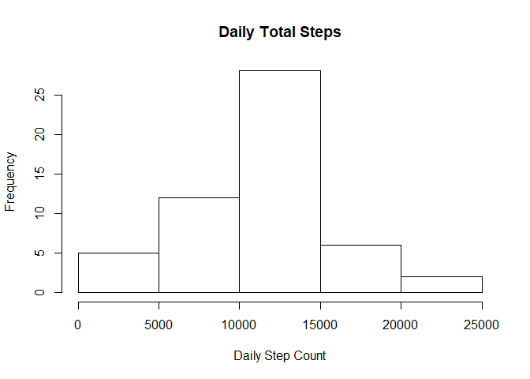
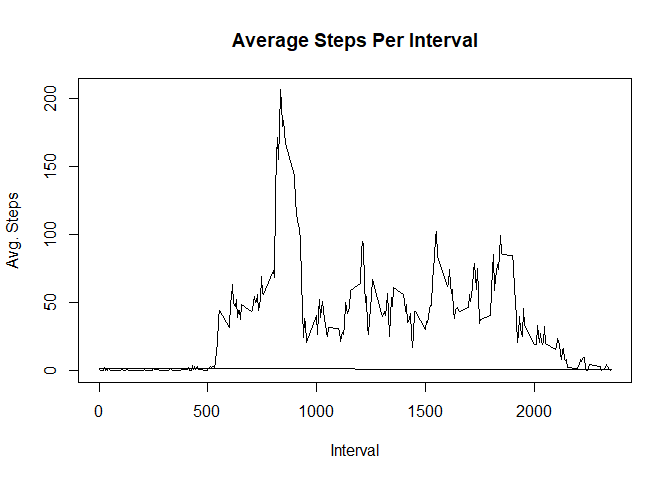
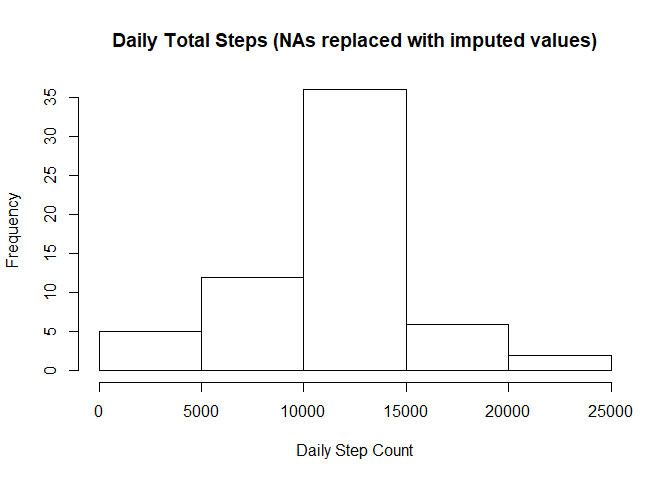
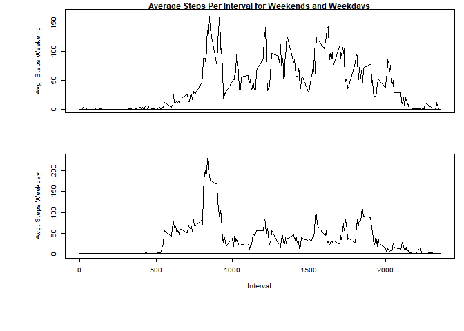

# Peer-graded Assignment: Reproducible Research Course Project 1
Steve Escott  
August 10, 2017  


###Read and process the data

```r
AMD<-read.csv("C:/Users/User/OneDriveSAE/OneDrive/Documents/Coursera/ActivityMonitoringData/activity.csv")
AMD$date<-as.Date(AMD$date,"%Y-%m-%d")
```
### Question 1: What is mean total number of steps taken per day?

For this part of the assignment, you can ignore the missing values in the dataset.

1.1) Calculate the total number of steps taken per day


```r
daySteps<-tapply(AMD$steps,AMD$date,sum)
head(daySteps)
```

```
## 2012-10-01 2012-10-02 2012-10-03 2012-10-04 2012-10-05 2012-10-06 
##         NA        126      11352      12116      13294      15420
```

1.2) Make a histogram of the total number of steps taken each day:

```r
hist(daySteps, main = "Daily Total Steps", xlab = "Daily Step Count")
```

<!-- -->

1.3) Calculate and report the mean and median of the total number of steps taken per day

```r
meanStepsDay<-round(mean(daySteps, na.rm = TRUE),digits=2)
medianStepsDay<-median(daySteps, na.rm = TRUE)
paste("The mean is",round(mean(daySteps, na.rm = TRUE),digits=2))
```

```
## [1] "The mean is 10766.19"
```

```r
paste("The median is ",median(daySteps, na.rm = TRUE))
```

```
## [1] "The median is  10765"
```
###Question 2: What is the average daily activity pattern?
2.1) Make a time series plot (i.e. type = "l") of the 5-minute interval (x-axis) and the average number of steps taken, averaged across all days (y-axis).

```r
AMDnotNA<-AMD[complete.cases(AMD), ]
AMDnotNA$intMean<-tapply(AMDnotNA$steps,AMDnotNA$interval,mean)
plot(AMDnotNA$interval,AMDnotNA$intMean, type="l",  main="Average Steps Per Interval", ylab="Avg. Steps", xlab="Interval")
```

<!-- -->

2.2) Which 5-minute interval, on average across all the days in the dataset, contains the maximum number of steps?

```r
AMDnotNA$interval[which.max(AMDnotNA$intMean)]
```

```
## [1] 835
```
...And for good measure, that maximun interval step amount was:

```r
AMDnotNA$intMean[which.max(AMDnotNA$intMean)]
```

```
## [1] 206.1698
```

###Question 3: Imputing missing values
Note that there are a number of days/intervals where there are missing values (coded as NA). The presence of missing days may introduce bias into some calculations or summaries of the data.

3.1) Calculate and report the total number of missing values in the dataset (i.e. the total number of rows with NAs).

```r
sum(is.na(AMD))
```

```
## [1] 2304
```

3.2) Devise a strategy for filling in all of the missing values in the dataset. The strategy does not need to be sophisticated. For example, you could use the mean/median for that day, or the mean for that 5-minute interval, etc.

*Strategy*

Using the mean for an interval is the best way to go here, since there are whole days in which every "steps" value is NA, making it impossible to use that day's mean. The imputations will be rounded to the 2 decimal places. The code for doing so and addingthem to the new ImpSteps variable is below:

```r
AMD$ImpSteps<- round(tapply(AMD$steps,AMD$interval,mean, na.rm=TRUE), digits = 2)
head(AMD)
```

```
##   steps       date interval ImpSteps
## 1    NA 2012-10-01        0     1.72
## 2    NA 2012-10-01        5     0.34
## 3    NA 2012-10-01       10     0.13
## 4    NA 2012-10-01       15     0.15
## 5    NA 2012-10-01       20     0.08
## 6    NA 2012-10-01       25     2.09
```

3.3) Create a new dataset that is equal to the original dataset but with the missing data filled in.


```r
AMDimp<-AMD
AMDimp$steps[is.na(AMDimp$steps)] <- round(AMDimp$ImpSteps[is.na(AMDimp$steps)],digits=2)
head(AMDimp)
```

```
##   steps       date interval ImpSteps
## 1  1.72 2012-10-01        0     1.72
## 2  0.34 2012-10-01        5     0.34
## 3  0.13 2012-10-01       10     0.13
## 4  0.15 2012-10-01       15     0.15
## 5  0.08 2012-10-01       20     0.08
## 6  2.09 2012-10-01       25     2.09
```

3.4) Make a histogram of the total number of steps taken each day and Calculate and report the mean and median total number of steps taken per day. Do these values differ from the estimates from the first part of the assignment? What is the impact of imputing missing data on the estimates of the total daily number of steps?

The total number of steps taken per day:

```r
dayStepsImp<-tapply(AMDimp$steps,AMDimp$date,sum)
head(dayStepsImp)
```

```
## 2012-10-01 2012-10-02 2012-10-03 2012-10-04 2012-10-05 2012-10-06 
##   10766.13     126.00   11352.00   12116.00   13294.00   15420.00
```

A Histogram showing Daily Total Steps with NAs replaced with imputed values

```r
hist(dayStepsImp, main = "Daily Total Steps (NAs replaced with imputed values)", xlab = "Daily Step Count")
```

<!-- -->

*And now...*
The mean and median total number of steps taken per day.


```r
meanStepsImpDay<-round(mean(dayStepsImp),digits=2)
medianStepsImpDay<-median(dayStepsImp, na.rm = TRUE)
paste("The mean is",round(mean(dayStepsImp),digits=2))
```

```
## [1] "The mean is 10766.18"
```

```r
paste("The median is ",median(dayStepsImp))
```

```
## [1] "The median is  10766.13"
```

*The Difference, and the impact...*
These values differ from the estimates from the first part of the assignment, in that the mean is lower by .01 steps per day, and the median is higher by 1.13 steps. The resultant impact of the imputation is that the difference between the mean and median has been reduced from 1.19 to 0.05 steps per day.


```r
paste("The old difference between the mean and the median = ",round(meanStepsDay-medianStepsDay, digits=2))
```

```
## [1] "The old difference between the mean and the median =  1.19"
```

```r
paste("The new difference between the mean and the median = ",round(meanStepsImpDay-medianStepsImpDay, digits=2))
```

```
## [1] "The new difference between the mean and the median =  0.05"
```

```r
paste("The difference has been reduced by", round(((round(meanStepsDay-medianStepsDay, digits=2)-round(meanStepsImpDay-medianStepsImpDay, digits=2))/round(meanStepsDay-medianStepsDay, digits=2))*100,digits=2),"percent.")
```

```
## [1] "The difference has been reduced by 95.8 percent."
```

###Question 4: Are there differences in activity patterns between weekdays and weekends?
For this part the weekdays() function may be of some help here. Use the dataset with the filled-in missing values for this part.

4.1) Create a new factor variable in the dataset with two levels - "weekday" and "weekend" indicating whether a given date is a weekday or weekend day.

*The imputed values will be used to answer this question*

First, a vector of weekdays is created:

```r
weekday <- c('Monday', 'Tuesday', 'Wednesday', 'Thursday', 'Friday')
weekday
```

```
## [1] "Monday"    "Tuesday"   "Wednesday" "Thursday"  "Friday"
```

Then the "Wk.day.end"" factor variable is created in the AMD dataset, specifying the weekday or weekend levels:

```r
AMDimp$Wk.day.end <- factor((weekdays(AMDimp$date) %in% weekday),levels=c(FALSE, TRUE), labels=c('weekend', 'weekday'))
head(AMDimp)
```

```
##   steps       date interval ImpSteps Wk.day.end
## 1  1.72 2012-10-01        0     1.72    weekday
## 2  0.34 2012-10-01        5     0.34    weekday
## 3  0.13 2012-10-01       10     0.13    weekday
## 4  0.15 2012-10-01       15     0.15    weekday
## 5  0.08 2012-10-01       20     0.08    weekday
## 6  2.09 2012-10-01       25     2.09    weekday
```

4.2) Make a panel plot containing a time series plot (i.e. type = "l") of the 5-minute interval (x-axis) and the average number of steps taken, averaged across all weekday days or weekend days (y-axis). See the README file in the GitHub repository to see an example of what this plot should look like using simulated data.

First recalculate interval means separately for weekends and weekdays, creating separate dataframes for each:

```r
AMDimpWkEnd<-AMDimp[AMDimp$Wk.day.end=="weekend",]
AMDimpWkDay<-AMDimp[AMDimp$Wk.day.end=="weekday",]
AMDimpWkEnd$intMean<-tapply(AMDimpWkEnd$steps,AMDimpWkEnd$interval, mean)
AMDimpWkDay$intMean<-tapply(AMDimpWkDay$steps,AMDimpWkDay$interval, mean)
```

Then create the plots


```r
par(mfrow = c(2,1), cex = 0.6, oma = (c(5,4,0,0)+0.1), mar = (c(4,4,1,1) + 0.1))
    plot(AMDimpWkEnd$interval,AMDimpWkEnd$intMean, type="l",  main="Average Steps Per Interval for Weekends and Weekdays", ylab="Avg. Steps Weekend", xaxt='n', xlab=" ")
    plot(AMDimpWkDay$interval,AMDimpWkDay$intMean, type="l",  ylab="Avg. Steps Weekday", xlab="Interval")
```

<!-- -->
